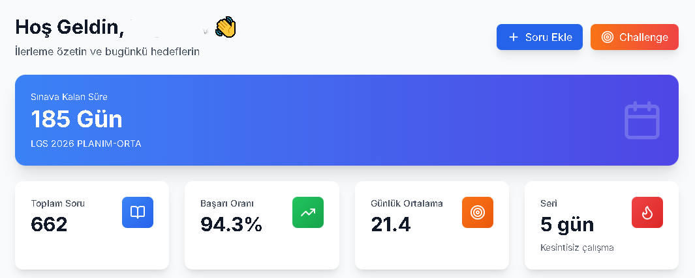

# Nowa Study - Exam Preparation & Tracking System

> *Note: This is a public showcase of the proprietary **Nowa Study** platform. The source code is private and protected.*

## 🚀 Overview

**Nowa Study** is a comprehensive advanced web application designed to help students track their exam preparation progress (specifically for LGS and other standardized tests). It provides detailed analytics, daily progress tracking, and performance insights to optimize study habits.

This project demonstrates meaningful integration of modern web technologies to solve real-world productivity problems for students.

## ✨ Key Features

*   **📊 Interactive Dashboard:** Real-time overview of daily tasks, streaks, and upcoming goals.
*   **📈 Advanced Analytics:** Visual charts (using Recharts/Chart.js) showing success rates, question distribution, and subject-wise performance.
*   **📝 Practice Session Tracking:** Detailed logging of study sessions, including question counts and correct/wrong ratios.
*   **🏆 Exam Results Integration:** Seamless integration of full mock exam results into the overall statistics.
*   **📅 Daily Progress Logs:** Calendar-based interaction for tracking consistency.
*   **🤖 AI Integration:** (Prototype) Smart suggestions for study plans based on performance data.

## 🛠️ Technology Stack

High-performance tech stack ensuring scalability and smooth user experience:

*   **Frontend:** [Next.js](https://nextjs.org/) (React), [TypeScript](https://www.typescriptlang.org/)
*   **Styling:** [Tailwind CSS](https://tailwindcss.com/) with [Shadcn UI](https://ui.shadcn.com/) components
*   **Backend/Database:** [Prisma ORM](https://www.prisma.io/) with SQLite (Local) / Postgres (Production)
*   **State Management:** React Query & Zustand
*   **Charts:** Recharts & Chart.js

## 📸 Screenshots

<!-- 
INSTRUCTIONS: 
Upload your screenshots to the 'assets' folder in this repo and uncomment the lines below.
-->

<!--
### Dashboard View

### Statistics Page

### Exam Result Entry

-->

## 🔒 License & Usage

Copyright (c) 2025 **Nowa Study**. All Rights Reserved.

The source code for this project is **proprietary**. This repository serves as a portfolio showcase. Unauthorized copying, modification, distribution, or use of the source code is strictly prohibited.

For business inquiries or technical demonstrations, please contact:
**[Your Name / Contact Info]**

---

*Built with ❤️ by [HakanKaraboğaz]*
